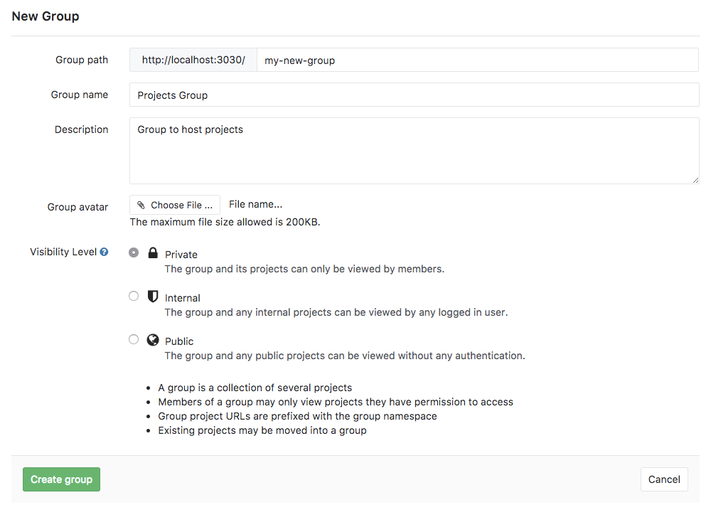

# How to create a group in GitLab

Your projects in GitLab can be organized in 2 different ways:
under your own namespace for single projects, such as `your-name/project-1` or
under groups.

If you organize your projects under a group, it works like a folder. You can
manage your group members' permissions and access to the projects.

---

To create a group:

1. Expand the left sidebar by clicking the three bars at the upper left corner
   and then navigate to **Groups**.

    

1. Once in your groups dashboard, click on **New group**.

    

1. Fill out the needed information:

    1. Set the "Group path" which will be the namespace under which your projects
       will be hosted (path can contain only letters, digits, underscores, dashes
       and dots; it cannot start with dashes or end in dot).
    1. The "Group name" will populate with the path.  Optionally, you can change
       it.  This is the name that will display in the group views.
    1. Optionally, you can add a description so that others can briefly understand
       what this group is about.
    1. Optionally, choose and avatar for your project.
    1. Choose the [visibility level](../public_access/public_access.md).

1. Finally, click the **Create group** button.

## Add a new project to a group

There are 2 different ways to add a new project to a group:

- Select a group and then click on the **New project** button.

    

    You can then continue on [creating a project](create-project.md).

- While you are [creating a project](create-project.md), select a group namespace
  you've already created from the dropdown menu.

    
