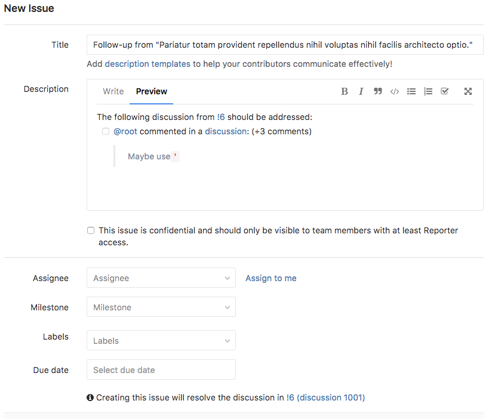
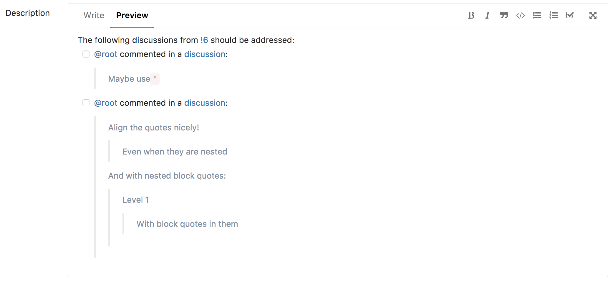

# Discussions

The ability to contribute conversationally is offered throughout GitLab.

## Standard Comments

Standard comments can be added to issues, merge requests, snippets, commits and commit diffs.

## Resolvable Discussions

Resolvable discussions can be added to merge request diffs, merge requests, issues, commits and snippets.

Discussion resolution helps keep track of progress during planning or code review.
Resolving comments prevents you from forgetting to address feedback and lets you
hide discussions that are no longer relevant.

!["A discussion between two people on a piece of code"][discussion-view]

Comments and discussions can be resolved by anyone with at least Developer
access to the project or the author of the merge request.

### Marking a comment or discussion as resolved

You can mark a discussion as resolved by clicking the "Resolve discussion"
button at the bottom of the discussion.

!["Resolve discussion" button][resolve-discussion-button]

Alternatively, you can mark each comment as resolved individually.

!["Resolve comment" button][resolve-comment-button]

### Moving a single discussion to a new issue

> [Introduced][ce-8266] in GitLab 9.1

To create a new issue for a single discussion, you can use the **Resolve this
discussion in a new issue** button.

This will direct you to a new issue prefilled with the content of the
discussion, similar to the issues created for delegating multiple
discussions at once.

Saving the issue will mark the discussion as resolved and add a note
to the discussion referencing the new issue.

[ce-5022]: https://gitlab.com/gitlab-org/gitlab-ce/merge_requests/5022
[ce-7125]: https://gitlab.com/gitlab-org/gitlab-ce/merge_requests/7125
[ce-7180]: https://gitlab.com/gitlab-org/gitlab-ce/merge_requests/7180
[ce-8266]: https://gitlab.com/gitlab-org/gitlab-ce/merge_requests/8266
[resolve-discussion-button]: img/resolve_discussion_button.png
[resolve-comment-button]: img/resolve_comment_button.png
[discussion-view]: img/discussion_view.png
[discussions-resolved]: img/discussions_resolved.png

## Merge request diffs

> [Introduced][ce-5022] in GitLab 8.11.

Discussions can be started on merge request diffs to keep track of progress during code review.

!["A discussion between two people on a piece of code"][discussion-view]

### Jumping between unresolved discussions

When a merge request has a large number of comments it can be difficult to track
what remains unresolved. You can jump between unresolved discussions with the
Jump button next to the Reply field on a discussion.

You can also jump to the first unresolved discussion from the button next to the
resolved discussions tracker.

!["3/4 discussions resolved"][discussions-resolved]

### Only allow merge requests to be merged if all discussions are resolved

> [Introduced][ce-7125] in GitLab 8.14.

You can prevent merge requests from being merged until all discussions are
resolved.

Navigate to your project's settings page, select the
**Only allow merge requests to be merged if all discussions are resolved** check
box and hit **Save** for the changes to take effect.

From now on, you will not be able to merge from the UI until all discussions
are resolved.

### Move all unresolved discussions in a merge request to an issue

> [Introduced][ce-8266] in GitLab 9.1

To continue all open discussions in a merge request, click the button **Resolve
all discussions in new issue**

Alternatively, when your project only accepts merge requests when all discussions
are resolved, there will be an **open an issue to resolve them later** link in
the merge request-widget.

This will prepare an issue with content referring to the merge request and
discussions.

Hitting **Submit issue** will cause all discussions to be marked as resolved and
add a note referring to the newly created issue.

You can now proceed to merge the merge request from the UI.

## Issues, commits, snippets and merge requests

> [Introduced][ce-7527] in GitLab 9.1.

Discussions can be started on issues, commits, snippets and merge requests.

Resolvable discussions can be added to merge request diffs, but discussions can also be added without a diff.

To start a discussion, you can click on the "Comment" button toggle dropdown, select "Start discussion" and click "Start discussion" when you're ready to post the comment.

This will post a comment with a single thread to allow you to discuss specific comments in greater detail.

